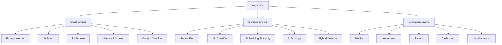

```mermaid
flowchart TD
    A[AegisLLM]

    A --> B[Attack Engine]
    A --> C[Defense Engine]
    A --> D[Evaluation Engine]

    B --> B1[Prompt Injection]
    B --> B2[Jailbreak]
    B --> B3[Tool Abuse]
    B --> B4[Memory Poisoning]
    B --> B5[Context Overflow]

    C --> C1[Regex Filter]
    C --> C2[ML Classifier]
    C --> C3[Embedding Similarity]
    C --> C4[LLM Judge]
    C --> C5[Hybrid Defense]

    D --> D1[Metrics]
    D --> D2[Leaderboard]
    D --> D3[Reports]
    D --> D4[Dashboard]
    D --> D5[Visual Analytics]
```
