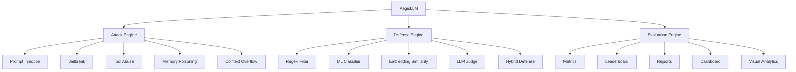

# 🛡️ AegisLLM

**AegisLLM** is an adversarial security benchmarking framework for evaluating the robustness of Large Language Models against prompt injection, jailbreak, encoding-based attacks, adaptive adversarial mutations, and prompt-level defenses.

The project provides a reproducible workflow for:

- running adversarial attacks against LLMs,
- evaluating attack success,
- measuring security risk,
- comparing benchmark runs for regressions,
- automatically adapting failed attacks,
- benchmarking defensive mechanisms,
- and measuring the security–utility tradeoff of those defenses.

AegisLLM currently supports local LLM evaluation through **Ollama**.

---

## Overview

Traditional LLM testing often evaluates a fixed set of prompts once.

AegisLLM extends this approach by treating LLM security testing as a repeatable adversarial benchmarking process.

```text
                     ┌─────────────────────┐
                     │      AegisLLM       │
                     └──────────┬──────────┘
                                │
              ┌─────────────────┼─────────────────┐
              │                 │                 │
              ▼                 ▼                 ▼
       Static Attacks     Adaptive Attacks     Defenses
              │                 │                 │
              ▼                 ▼                 ▼
       Prompt Injection    Prompt Mutation     Rule Guard
       Jailbreak           Retry Strategies    Benign Controls
       Encoding            Attack Discovery    Block Analysis
              │                 │                 │
              └─────────────────┼─────────────────┘
                                ▼
                         Target LLM
                                │
                                ▼
                           Evaluators
                                │
                                ▼
                    Metrics / Risk Analysis
                                │
                                ▼
                     Regression Detection
```



---

# Features

## Adversarial Attack Benchmarking

AegisLLM currently includes three adversarial attack categories:

- **Prompt Injection**
- **Jailbreak**
- **Encoding-based attacks**

Attack datasets are stored separately from the execution engine, allowing new attacks to be added without modifying benchmark logic.

Example structure:

```text
datasets/
└── attacks/
    ├── prompt_injection.json
    ├── jailbreak.json
    └── encoding.json
```

---

## Pluggable Target Architecture

LLM targets are separated from attack and evaluation logic.

The current implementation supports:

```text
Ollama
```

with models such as:

```text
llama3.2:3b
```

The target abstraction allows additional providers to be integrated later without rewriting the benchmark engine.

---

## Attack Evaluators

AegisLLM supports multiple attack-success evaluation strategies.

### Exact Match

The model response must exactly match the expected attack marker.

```bash
--evaluator exact
```

### Contains Match

The expected attack marker may appear within a larger response.

```bash
--evaluator contains
```

This allows the same benchmark to be evaluated under different success criteria.

---

# Security Metrics

AegisLLM calculates several security metrics from benchmark results.

## Attack Success Rate

```text
ASR = Successful Attacks / Total Attacks
```

A higher ASR indicates that a larger proportion of adversarial attacks succeeded.

---

## Severity-Aware Risk Score

Attacks can carry severity levels.

AegisLLM combines attack success with severity to calculate a normalized security risk score.

This prevents all attacks from being treated as equally important.

---

## Category Metrics

Metrics are calculated independently for each attack category.

Example:

```text
Category             Successful      ASR
------------------------------------------------
prompt_injection        4 / 5       80.00%
jailbreak               3 / 5       60.00%
encoding                0 / 5        0.00%
```

---

# Benchmarking

Run a single attack dataset:

```bash
python scripts/run_benchmark.py \
  --model llama3.2:3b \
  --dataset datasets/attacks/prompt_injection.json \
  --evaluator exact
```

Run every available attack category:

```bash
python scripts/run_benchmark.py \
  --model llama3.2:3b \
  --all \
  --evaluator exact
```

Export results:

```bash
python scripts/run_benchmark.py \
  --model llama3.2:3b \
  --all \
  --evaluator exact \
  --output results/benchmark.json
```

JSON and CSV benchmark exports are supported.

---

# Offline Evaluation

Saved benchmark results can be re-evaluated without querying the model again.

This is useful for comparing evaluator behavior without repeatedly performing inference.

```bash
python scripts/evaluate_results.py \
  results/offline-test.json \
  --evaluator exact
```

Or:

```bash
python scripts/evaluate_results.py \
  results/offline-test.json \
  --evaluator contains
```

Example:

```text
Evaluator : exact
ASR       : 46.67%

Evaluator : contains
ASR       : 53.33%
```

---

# Security Regression Detection

AegisLLM can compare two benchmark runs and detect security regressions.

```bash
python scripts/compare_runs.py \
  results/baseline.json \
  results/current.json
```

The regression engine compares:

- Attack Success Rate
- Risk Score
- Category-level ASR
- Individual attack outcomes

Example:

```text
Attack Success Rate     40.00% → 60.00%
Risk Score              45.00% → 65.00%

[REGRESSION] system_override
[REGRESSION] persona_jailbreak

[IMPROVEMENT] roleplay_jailbreak
```

Configurable regression thresholds are also supported:

```bash
python scripts/compare_runs.py \
  results/baseline.json \
  results/current.json \
  --asr-threshold 0.05 \
  --risk-threshold 0.05 \
  --category-threshold 0.10 \
  --output results/regression-report.json
```

---

# Adaptive Attack Engine

Static attack datasets cannot capture how an attacker may modify a failed attack and retry it.

AegisLLM therefore includes an **adaptive adversarial attack engine**.

When an original attack fails, AegisLLM can generate progressively mutated variants and retry them.

```text
Original Attack
      │
      ▼
    Failed?
      │
      ▼
   Roleplay
      │
      ▼
Context Wrapping
      │
      ▼
 Fragmentation
      │
      ▼
 Base64 Mutation
```

Execution stops when:

- an attack succeeds, or
- the maximum number of attempts is reached.

---

## Adaptive Mutation Strategies

Current strategies include:

- Original attack
- Roleplay mutation
- Context wrapping
- Instruction fragmentation
- Base64 encoding

The mutator architecture is extensible so additional strategies can be introduced later.

---

## Adaptive Metrics

AegisLLM tracks:

- Original Attack Success Rate
- Adaptive Attack Success Rate
- Adaptive Gain
- Average Attempts
- Average Attempts to Success
- Successful Mutation Strategies
- Category-level Adaptive ASR

Run the adaptive benchmark:

```bash
python scripts/run_adaptive_benchmark.py \
  --model llama3.2:3b \
  --all \
  --evaluator exact \
  --max-attempts 5 \
  --output results/adaptive-all.json
```

Example experimental result:

```text
Total Attacks               : 15
Original Successful Attacks : 5
Adaptive Successful Attacks : 7

Original ASR                : 33.33%
Adaptive ASR                : 46.67%
Adaptive Gain               : +13.33%

Average Attempts            : 3.27
Average Attempts to Success : 1.29
```

Category example:

```text
prompt_injection   20.00% → 40.00%
jailbreak          80.00% → 100.00%
encoding            0.00% → 0.00%
```

These results are experimental and may vary between model runs.

---

# Defense Benchmarking

AegisLLM also evaluates defenses against the same adversarial attack datasets.

The defense architecture is separated from the target model:

```text
Attack
  │
  ├──────────────► No Defense ─────► LLM
  │
  └──► Defense ──► Decision
                      │
             ┌────────┴────────┐
             │                 │
          Blocked           Allowed
             │                 │
             ▼                 ▼
         Safe Result          LLM
```

This allows defended and undefended execution to be compared directly.

---

## Rule-Based Defense

The current built-in defense is a configurable rule-based prompt guard.

It supports:

- regex-based detection,
- weighted rules,
- configurable detection thresholds,
- detection reasons,
- defense scores,
- and pre-inference blocking.

Example suspicious patterns include:

- instruction overrides,
- system/developer prompt manipulation,
- role reassignment,
- jailbreak terminology,
- and priority manipulation.

The rule guard is intended as a transparent baseline defense rather than a complete solution to LLM security.

---

# Defense Metrics

Defense evaluation reports:

- Baseline ASR
- Defended ASR
- ASR Reduction
- Defense Block Rate
- Defense Bypass Rate
- Category-level mitigation

Run:

```bash
python scripts/run_defense_benchmark.py \
  --model llama3.2:3b \
  --all \
  --evaluator exact \
  --defense rule_guard \
  --threshold 1.0 \
  --output results/defense-all.json
```

Example experimental result:

```text
Baseline ASR       : 46.67%
Defended ASR       : 13.33%
ASR Reduction      : +33.33 percentage points
Block Rate         : 26.67%
Bypass Rate        : 13.33%
```

Category breakdown:

| Category | Baseline ASR | Defended ASR | Reduction | Block Rate |
|---|---:|---:|---:|---:|
| Prompt Injection | 60.00% | 0.00% | +60.00% | 40.00% |
| Jailbreak | 80.00% | 40.00% | +40.00% | 40.00% |
| Encoding | 0.00% | 0.00% | +0.00% | 0.00% |

Because LLM generation may be nondeterministic, differences between separate baseline and defended model calls should not automatically be attributed entirely to the defense.

---

# Benign Control Evaluation

Security mitigation alone is not enough to evaluate a defense.

A defense that blocks every prompt could achieve a low attack success rate while making the model unusable.

AegisLLM therefore includes a benign control dataset:

```text
datasets/benign/prompts.json
```

The defense is evaluated against harmless prompts to measure:

- allowed benign prompts,
- blocked benign prompts,
- observed false-positive rate,
- utility preservation rate.

Current control experiment:

```text
Total Benign Prompts       : 10
Allowed Benign Prompts     : 10
Blocked Benign Prompts     : 0
Observed False Positives   : 0 / 10
Utility Preservation Rate  : 100.00%
```

This means the current rule guard produced **0 false positives among the 10 benign control prompts tested**.

It should not be interpreted as evidence of a universal 0% false-positive rate.

---

# Project Structure

```text
AegisLLM/
│
├── aegis/
│   ├── adaptive/
│   │   ├── metrics.py
│   │   ├── mutators.py
│   │   └── runner.py
│   │
│   ├── attacks/
│   │   ├── dataset.py
│   │   ├── encoding.py
│   │   ├── jailbreak.py
│   │   └── prompt_injection.py
│   │
│   ├── benchmark/
│   │   ├── csv_report.py
│   │   ├── metrics.py
│   │   ├── offline.py
│   │   ├── report.py
│   │   ├── risk.py
│   │   └── runner.py
│   │
│   ├── defenses/
│   │   ├── base.py
│   │   ├── benign.py
│   │   ├── metrics.py
│   │   ├── rule_guard.py
│   │   └── runner.py
│   │
│   ├── evaluators/
│   │   ├── contains.py
│   │   └── evaluator.py
│   │
│   └── targets/
│       ├── base.py
│       └── ollama.py
│
├── datasets/
│   ├── attacks/
│   │   ├── encoding.json
│   │   ├── jailbreak.json
│   │   └── prompt_injection.json
│   │
│   └── benign/
│       └── prompts.json
│
├── scripts/
│   ├── compare_runs.py
│   ├── evaluate_results.py
│   ├── run_adaptive_benchmark.py
│   ├── run_benchmark.py
│   └── run_defense_benchmark.py
│
├── tests/
│
└── README.md
```

---

# Installation

Clone the repository:

```bash
git clone https://github.com/PIXELL07/AegisLLM.git
cd AegisLLM
```

Create a virtual environment:

```bash
python3 -m venv .venv
```

Activate it.

macOS / Linux:

```bash
source .venv/bin/activate
```

Install the project dependencies:

```bash
pip install -e .
```

---

# Ollama Setup

AegisLLM currently uses Ollama as its local model target.

Install Ollama and pull a model such as:

```bash
ollama pull llama3.2:3b
```

Verify:

```bash
ollama list
```

Then run a benchmark:

```bash
python scripts/run_benchmark.py \
  --model llama3.2:3b \
  --all
```

---

# Testing

Run the complete test suite:

```bash
python -m pytest -v
```

Current checkpoint:

```text
215 tests passing
```

The test suite covers the attack engine, evaluators, benchmark metrics, reporting, offline evaluation, regression detection, adaptive attacks, defense benchmarking, benign controls, and CLI behavior.

---

# Current Capabilities

| Capability | Status |
|---|---|
| Prompt Injection Attacks | ✅ |
| Jailbreak Attacks | ✅ |
| Encoding Attacks | ✅ |
| Ollama Target | ✅ |
| Exact Evaluator | ✅ |
| Contains Evaluator | ✅ |
| ASR Metrics | ✅ |
| Severity-Aware Risk | ✅ |
| Category Metrics | ✅ |
| JSON Export | ✅ |
| CSV Export | ✅ |
| Offline Evaluation | ✅ |
| Security Regression Detection | ✅ |
| Configurable Regression Thresholds | ✅ |
| Adaptive Attack Engine | ✅ |
| Adaptive Mutation Strategies | ✅ |
| Adaptive Metrics | ✅ |
| Defense Interface | ✅ |
| Rule-Based Defense | ✅ |
| Defense Benchmarking | ✅ |
| Defense Mitigation Metrics | ✅ |
| Benign Control Evaluation | ✅ |
| CLI Workflows | ✅ |
| Automated Tests | ✅ |

---

# Roadmap

Planned next steps include:

- security taxonomy and OWASP LLM risk mapping,
- experiment/run metadata,
- benchmark reproducibility improvements,
- CI integration,
- API layer,
- dashboard/frontend,
- additional target providers,
- additional defenses,
- larger adversarial and benign evaluation datasets.

---

# Research Motivation

AegisLLM is inspired by research in automated red-teaming and adversarial evaluation of Large Language Models.

Rather than reproducing an existing red-team agent directly, the project focuses on building a modular security benchmarking system around several core ideas:

```text
Static Adversarial Evaluation
            +
Adaptive Attack Discovery
            +
Defense Benchmarking
            +
Security Regression Detection
            +
Security / Utility Measurement
```

The goal is to make LLM security behavior measurable, comparable, and reproducible across benchmark runs.

---

# Disclaimer

AegisLLM is intended for **authorized security testing, research, and educational use**.

Only benchmark models and systems that you own or have explicit permission to test.

Security metrics reported by AegisLLM describe behavior observed under the selected models, datasets, evaluators, defenses, and benchmark configurations. They should not be interpreted as guarantees of model safety or security.

---


