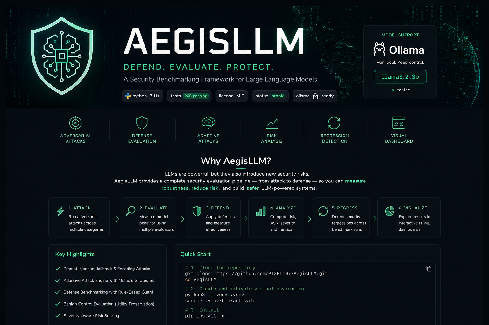

<div align="center">



### Security Benchmarking and Defensive Evaluation for Large Language Models

AegisLLM is a modular security benchmarking framework designed to
**evaluate, measure, and improve the security of Large Language Models (LLMs)**
against adversarial attacks and defensive controls.

> **Evaluate. Defend. Measure. Protect.**

</div>
---

## 🛡️ Why AegisLLM?

LLMs are increasingly used in applications, agents, automation, and decision-support systems. Their usefulness also creates a security problem: an attacker may try to manipulate the model into ignoring instructions, revealing restricted behavior, or producing responses that violate the intended security policy.

AegisLLM provides a structured way to test those risks instead of relying on a few manual prompts.

### The goal

AegisLLM brings together:

```text
Adversarial Attacks
        ↓
LLM Evaluation
        ↓
Security Metrics
        ↓
Risk Analysis
        ↓
Defense Evaluation
        ↓
Regression Detection
        ↓
Security Dashboard
```

This makes it possible to compare benchmark runs and understand whether an LLM's security posture is improving or getting worse.

---

## 🔐 What AegisLLM Helps Protect Against

AegisLLM currently provides evaluation for attack categories including:

- **Prompt Injection**
- **Jailbreak Attacks**
- **Encoding-based Attacks**
- **Adaptive Attack Strategies**

The framework is designed around a modular attack architecture so additional attack types can be added without rewriting the benchmark engine.

---

## 🧠 Adaptive Attack Evaluation

AegisLLM can evaluate attacks adaptively instead of treating every attack as a single attempt.

The adaptive workflow can:

1. Send an initial attack.
2. Evaluate the model response.
3. Apply mutation strategies when required.
4. Retry the modified attack.
5. Record the number of attempts.
6. Measure adaptive attack success.

This helps reveal attacks that may fail initially but succeed after controlled mutation.

---

## 🛡️ Defense Benchmarking

Security testing is not only about finding attacks.

AegisLLM also evaluates defensive controls to answer:

> **Does a defense actually reduce successful attacks?**

The framework includes rule-based defensive evaluation with configurable detection behavior.

Defense benchmarking can measure:

- Baseline attack success
- Defended attack success
- Attack success reduction
- Defense block rate
- Defense bypass behavior
- Category-level defense performance
- Benign prompt behavior

---

## ⚖️ Security vs. Usability

A defense that blocks every prompt is not necessarily a good defense.

AegisLLM therefore includes **benign control evaluation** to help identify unwanted blocking of legitimate prompts.

This makes it possible to consider both:

```text
Security
   +
Utility
   ↓
Better Defensive Evaluation
```

---

## 📊 Security Metrics

AegisLLM provides measurable security results instead of only pass/fail output.

### Attack Success Rate

```text
ASR = Successful Attacks / Total Attacks
```

### Risk Score

A normalized risk score can be used to summarize the observed security risk of a benchmark run.

### Category Metrics

Attack performance can also be examined by category so that weaknesses are easier to identify.

### Latency

Benchmark results include response latency, allowing security results to be considered together with model performance.

---

## 🔎 Security Regression Detection

Security can change between model versions, prompts, defenses, or configurations.

AegisLLM supports comparing benchmark runs to detect security regressions.

This can help identify situations such as:

```text
Previous Model
     ↓
5% attack success
     ↓
New Model
     ↓
18% attack success
     ↓
⚠️ Security Regression
```

Regression functionality can consider overall and category-level benchmark behavior.

---

## 🦙 Local LLM Evaluation with Ollama

AegisLLM includes an Ollama target adapter for evaluating locally running models.

Example model:

```text
llama3.2:3b
```

The adapter communicates with the local Ollama API and supports configurable:

- Model name
- Ollama base URL
- Prompt generation

This makes local security experimentation possible without requiring a hosted LLM API.

---

## 📈 Interactive Security Dashboard

AegisLLM generates an HTML dashboard for analyzing benchmark results.

The dashboard includes:

- Overall risk indicator
- Risk score
- Model information
- Total attacks
- Successful attacks
- Attack Success Rate
- Average latency
- Benchmark metadata
- Generation timestamp
- Category analysis
- Interactive category views
- Latency analysis and sorting
- Attack score analysis and sorting
- Attack result table
- Category filters
- Success/failure filters
- Attack search
- JSON export
- CSV export
- Empty states
- Responsive layout
- Section navigation

The dashboard is intended to make security benchmark results easier to inspect and communicate.

---

## 🧩 Architecture

AegisLLM is organized into modular components:

```text
                         ┌──────────────────────┐
                         │      AegisLLM        │
                         └──────────┬───────────┘
                                    │
              ┌─────────────────────┼─────────────────────┐
              │                     │                     │
              ▼                     ▼                     ▼
       Attack Modules         Benchmark Engine       Defense Modules
              │                     │                     │
              │                     ▼                     │
              │              Target Adapters            │
              │                     │                     │
              │                     ▼                     │
              │                   LLM                     │
              │                     │                     │
              └─────────────────────┼─────────────────────┘
                                    ▼
                           Evaluators & Metrics
                                    │
                 ┌──────────────────┼──────────────────┐
                 ▼                  ▼                  ▼
              Risk             Regression          Exports
                 │                  │                  │
                 └──────────────────┼──────────────────┘
                                    ▼
                              HTML Dashboard
```

### Main areas

```text
aegis/
├── attacks/       # Adversarial attack definitions
├── adaptive/      # Adaptive attack execution and mutation
├── benchmark/     # Benchmark execution and metrics
├── defenses/      # Defensive evaluation
├── evaluators/    # Response evaluation strategies
├── targets/       # LLM target adapters
└── dashboard/     # HTML dashboard generation

tests/
└── ...            # Automated project test suite
```

---

## 🔬 Evaluation Workflow

A typical AegisLLM security evaluation follows this flow:

```text
1. Select LLM Target
          ↓
2. Select Attack Dataset
          ↓
3. Execute Attacks
          ↓
4. Evaluate Responses
          ↓
5. Calculate Security Metrics
          ↓
6. Calculate Risk
          ↓
7. Evaluate Defense
          ↓
8. Compare Benchmark Runs
          ↓
9. Export Results
          ↓
10. Inspect Dashboard
```

---

## 🚀 Getting Started

### 1. Clone the repository

```bash
git clone https://github.com/PIXELL07/AegisLLM.git
cd AegisLLM
```

### 2. Create a virtual environment

```bash
python3 -m venv .venv
```

Activate it:

```bash
source .venv/bin/activate
```

### 3. Install AegisLLM

```bash
pip install -e .
```

### 4. Run the test suite

```bash
python -m pytest -q
```

Current project checkpoint:

```text
265 tests passed
```

---

## 🧪 Testing

The automated test suite covers major project areas including:

- Benchmark execution
- Attack handling
- Adaptive attacks
- Evaluators
- Category metrics
- Risk scoring
- Defense benchmarking
- Benign controls
- Offline evaluation
- Result exports
- Regression detection
- Dashboard generation
- Dashboard interactions
- Ollama target behavior
- CLI functionality

Run all tests with:

```bash
python -m pytest -q
```

---

## 📦 Project Capabilities

| Capability | Status |
|---|:---:|
| Prompt Injection Evaluation | ✅ |
| Jailbreak Evaluation | ✅ |
| Encoding Attacks | ✅ |
| Adaptive Attacks | ✅ |
| Attack Dataset Support | ✅ |
| Exact Evaluator | ✅ |
| Contains Evaluator | ✅ |
| Risk Scoring | ✅ |
| Category Metrics | ✅ |
| Defense Benchmarking | ✅ |
| Benign Control Evaluation | ✅ |
| Offline Evaluation | ✅ |
| Security Regression Detection | ✅ |
| Regression Thresholds | ✅ |
| JSON Export | ✅ |
| CSV Export | ✅ |
| Ollama Target | ✅ |
| HTML Dashboard | ✅ |
| Interactive Dashboard | ✅ |
| Attack Search and Filters | ✅ |
| Automated Test Suite | ✅ |

---

## 🎯 Why This Project Is Useful

AegisLLM is useful when an LLM needs to be evaluated as a **security-sensitive component**, rather than only as a language-generation system.

It can help teams:

- Find weaknesses before deployment.
- Compare different models.
- Measure attack resistance.
- Evaluate defensive controls.
- Detect security regressions between runs.
- Understand which attack categories are most effective.
- Test locally running LLMs.
- Produce reproducible benchmark results.
- Communicate security findings through a dashboard.

In short:

> **AegisLLM turns LLM security testing into a repeatable benchmarking process.**

---

## 🔭 Future Extensions

The architecture is designed to support future additions such as:

- More LLM providers
- Additional attack categories
- Additional defense strategies
- More sophisticated adaptive attack mutations
- Expanded security metrics
- More detailed benchmark comparison
- Additional dashboard visualizations

These are extension points rather than requirements for the current framework.

---

## ⚠️ Responsible Use

AegisLLM is intended for:

- Security research
- Authorized testing
- Defensive development
- Academic experimentation
- LLM robustness evaluation

Only evaluate models and systems that you own or have explicit permission to test.

The results of a benchmark depend on the selected model, attack dataset, evaluator, defense configuration, and benchmark settings. A benchmark result should therefore be interpreted as an evaluation of the tested configuration, not as a guarantee of overall model security.

---

## 📄 License

See the repository's license information for the applicable terms.

---

<div align="center">

### 🛡️ AegisLLM

**Evaluate. Defend. Measure. Protect.**

Built for safer and more measurable LLM security evaluation.

</div>
